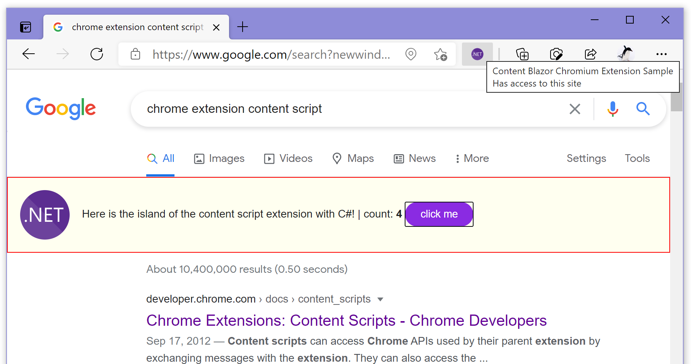

# Content Blazor Chromium Extension Sample

Build a content script chromium extension with C#!

## Summary

This chromium extension sample injects "counter" Blazor WebAssembly app written by C# into a Google search result page.

## Warning

- This sample code is a **"proof of concept"**, and is **an early prototype.**
- The implementation of this extension is just injecting the Blazor WebAssembly application into the current page, forcibly.
- This means, this extension **contaminates the current page with Blazor runtime. 
It is not isolated.**
- This sample code can not do `dotnet publish` correctly at this time.
- The output files of building this sample code contain numerous files that are unused for the chromium-browser extension.

## Installation instruction of this extension

### Requirements

- [.NET SDK 5.0.102](https://dotnet.microsoft.com/download/dotnet/5.0) or later
- Chromium browser (Google Chrome, Microsoft Edge) that was configured to enable developer mode of [the browser extension manager](chrome://extensions/).

### Step

1. Clone this repository on your PC or Mac.
2. Build it. (e.g. `dotnet build` command do that.)
3. Load the output directory of this project (e.g. `"{project folder}/bin/Debug/net5.0"`) to the Chromium browser (Google Chrome, Microsoft Edge) 's extension from the "Load unpacked" button.

After doing these instruction steps, you will see the contents of this extension on a Google search result page.

## Development the extension

You can build and run this project the same as a normal Blazor WebAssembly project.

You can do the `dotnet run` command, or open this project with Visual Studio Code or Visual Studio IDE and press `ctrl` + `f5` to build and launch it.

## License

[The Unlicense](LICENSE)